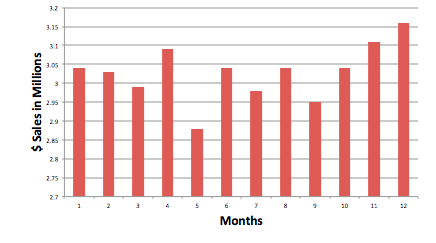

## Merchant - Sales month-over-month

Sonia, the general manager of nickelstore, has asked her sales staff to put together a month-on-month sales report.

Rudy runs the N1QL query to generate the data needed for his report. Try it out.

<pre id="example">
	SELECT substr(purchases.purchasedAt, 3, 4) as month, 
	round(sum(product.unitPrice * items.count)/1000000, 3) revenueMillion$
	FROM purchases unnest purchases.lineItems as items join product key items.product 
	GROUP BY substr(purchases.purchasedAt, 3, 4) 
	ORDER BY revenueMillion$ desc
</pre>
