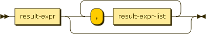
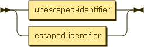
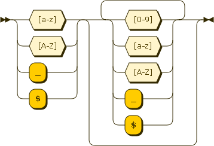
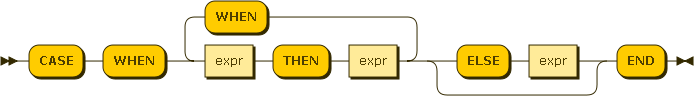

# Unstructured Query Language 2013 (UNQL 2013)

* Status: DRAFT/PROPOSAL
* Latest: [unql-2013](https://github.com/couchbaselabs/tuqqedin/blob/master/docs/unql-2013.md)

## Summary

Unstructured Query Language 2013 (UNQL 2013) is a query language for Couchbase Server.

This language attempts to satisfy these [requirements](https://github.com/couchbaselabs/tuqqedin/blob/master/docs/requirements.md).

This document describes the syntax and semantics of the language.

## Statement

An UNQL statement is an instance of:

unql-stmt:

### EXPLAIN

An UNQL statement can be preceded with the keyword "EXPLAIN".  This causes the statement to return information about how the UNQL statement would have operated if the EXPLAIN keyword had been omitted.

The output from EXPLAIN is intended for analysis and troublehsooting only.  The details of the output format are subject to change.

### SELECT Core

Before looking at the full SELECT statement, let us start with a simpler subset:

select-core:

result-expr-list:

result-expr:

The SELECT statement is used to query the bucket.  The result of a SELECT is an array containing zero or more result objects.

#### Select Procesing

The behavior of a SELECT query is best understood as a sequence of steps.  Output objects from a step become input objects to the next step.

1.  Filtering - result objects are filtered by the WHERE clause 
2.  Result Object Generation - result objects are generated from GROUP BY, and HAVING clauses and the result expression list
5.  Duplicate removal - if this is a DISTINCT query, duplicate result objects are removed

##### Filtering

If a WHERE clause is specified, the expression is evaluated for each object.  All objects evluating to TRUE are included in the result array.

##### Result Object Generation

Result object generation depends on whether or not this is an aggregate query.  An aggregate query is any query which either contains a GROUP BY clause or references one or more aggregate functions in the result expression list.

* Non-aggregate query - each result expression in the result expression list is evaluated once for each object.
* Aggregate query without GROUP BY - each result expression in the result expression list is evaluated once for a single group containing all objects.
* Aggregate query with GROUP BY - each expression the GROUP BY clause is evaluated once for each row.  Based on this evaluation each row is assigned to a group.  If a HAVING clause was also specified, it is evaluated once for each group.  If the result of evaluation is false this group is discarded.  Finally, each result expression in the result expression list is evaluated once for each group.

Final projection of evaluated result expressions is as follows:

1.  If the result expression list included '*', the result object starts as the original document.  Otherwise the result object starts empty.
2.  For each remaining expression in the result expression list.  If an AS clause was specified, that identifier is used as the key in the result object and the value is the evaluated expression.  If no AS clause was specified, a default name is generated for the key.

Specifying the same identifier more than once in the result expression list, or using an identifer that conflicts with a field in the document returned by '*' is allowed, but the resulting behavior is undefined.

See Appendix 5 for some example projections.

##### Duplicate Removal

If the ALL keyword was specified all result objects are retuned by the result array.  If the DISTINCT keyword was specified duplicate result objects are removed from the result array.  If neither ALL/DISTINCT keyword was specified, the statement behaves as if the ALL keyword had been specified.

### SELECT Statement

Now, we can expand to consider the full SELECT statement:

select-stmt:

ordering-term:

#### ORDER BY and LIMIT/OFFSET

If no ORDER BY clause is specified, the order in which the result objects are returned is undefined.

If an ORDER BY clause is specified, the order of items in the result array is determined by these expressions.  Objects are first sorted by the left-most expression in the list.  Any items with the same sort value are then sorted by the next expresion in the list.  This is repeated to break tie sort values until the end of the expression list is reached.  The order of objects with the same sort value for each sort expression is undefined.

As ORDER BY expressions can evaluate to any JSON value, it must define an ordering when comparing values of different types.  The following list describes the order by type (from lowest to highest):

* missing value
* null
* false
* true
* number
* string
* array (element by element comparison, longer arrays sort after)
* object (key/value by key/value comparison, larger objects sort after)

The LIMIT clause imposes an upper bound on the number of objects returned by the SELECT statement.  The LIMIT clause must be an integer.

An OFFSET clause can optionally follow a LIMIT clause.  When specified, this many rows are omitted from the result prior to enforcing the specified LIMIT.  The OFFSET clause must be an integer.

### Expressions

expr:

literal-value:

The full specification for literal values can be found in Appendix 4.

identfier:

An identifier can either be escaped or unescaped.  Unescaped identifiers cannot support the full range of idenfiers allowed in a JSON document, but do support the most common ones with a simpler syntax.  Escaped identifiers are surrounded with backticks and support all identifiers allowed in JSON.

unescaped-identfier:

escaped-identfier:

An identifier is a symbolic reference to a particular value in the current context.

If the current context is the document:

    {
    	"name": "unql"
    }

Then the indentifier *name* would evaluate to the value unql.

nested-expr:

Nested expressions support using the dot (`.`) operator to access fields nested inside of other objects as well as using the bracket notation (`[index]`) to access elements inside an array or object.

Consider the following object:

    {
      "address": {
      	"city": "Mountain View"
      },
      "revisions": [2013]
    }

 The expression `address.city` evalutes to the value `"Mountain View"`.

 The expression `revisions[0]` evaluates to the value `2013`.

case-expr:

CASE/WHEN/THEN/ELSE/END statements allow for conditional logic within an expression.  The first WHEN expression is evaluated.  If TRUE, the result of this expression is the THEN expression.  If not, subsequent WHEN clauses are evaluated in the same manner.  If none of the WHEN clauses evaluate to TRUE, then the result of the expression is the ELSE expression.  If no ELSE expression was provided, the result is NULL.

logical-term:

Logical terms allow for combining other expressions using boolean logic.  Standard AND, OR and NOT operators are supported.

### Four-valued logic

In UNQL boolean propositions could evaluate to NULL or MISSING.  The following table describes how these values relate to the logicla operators:

<table>
  <tr>
  	<th>A</th>
  	<th>B</th>
  	<th>A and B</th>
  	<th>A or B</th>
  </tr>
  <tr>
  	<td>FALSE</td>
  	<td>FALSE</td>
  	<td>FALSE</td>
  	<td>FALSE</td>
  </tr>
  <tr>
  	<td>FALSE</td>
  	<td>NULL</td>
  	<td>FALSE</td>
  	<td>NULL</td>
  </tr>
  <tr>
  	<td>FALSE</td>
  	<td>MISSING</td>
  	<td>FALSE</td>
  	<td>MISSING</td>
  </tr>
   <tr>
  	<td>FALSE</td>
  	<td>TRUE</td>
  	<td>FALSE</td>
  	<td>TRUE</td>
  </tr>

  <tr>
  	<td>NULL</td>
  	<td>FALSE</td>
  	<td>FALSE</td>
  	<td>NULL</td>
  </tr>
  <tr>
  	<td>NULL</td>
  	<td>NULL</td>
  	<td>NULL</td>
  	<td>NULL</td>
  </tr>
  <tr>
  	<td>NULL</td>
  	<td>MISSING</td>
  	<td>MISSING</td>
  	<td>MISSING</td>
  </tr>
   <tr>
  	<td>NULL</td>
  	<td>TRUE</td>
  	<td>NULL</td>
  	<td>TRUE</td>
  </tr>

  <tr>
  	<td>MISSING</td>
  	<td>FALSE</td>
  	<td>FALSE</td>
  	<td>MISSING</td>
  </tr>
  <tr>
  	<td>MISSING</td>
  	<td>NULL</td>
  	<td>MISSING</td>
  	<td>MISSING</td>
  </tr>
  <tr>
  	<td>MISSING</td>
  	<td>MISSING</td>
  	<td>MISSING</td>
  	<td>MISSING</td>
  </tr>
   <tr>
  	<td>MISSING</td>
  	<td>TRUE</td>
  	<td>MISSING</td>
  	<td>TRUE</td>
  </tr>

  <tr>
  	<td>TRUE</td>
  	<td>FALSE</td>
  	<td>FALSE</td>
  	<td>TRUE</td>
  </tr>
  <tr>
  	<td>TRUE</td>
  	<td>NULL</td>
  	<td>NULL</td>
  	<td>TRUE</td>
  </tr>
  <tr>
  	<td>TRUE</td>
  	<td>MISSING</td>
  	<td>MISSING</td>
  	<td>TRUE</td>
  </tr>
   <tr>
  	<td>TRUE</td>
  	<td>TRUE</td>
  	<td>TRUE</td>
  	<td>TRUE</td>
  </tr>
</table>

<table>
	<tr>
		<th>A</th>
		<th>not A</th>
	</tr>
	<tr>
		<td>FALSE</td>
		<td>TRUE</td>
	</tr>
	<tr>
		<td>NULL</td>
		<td>NULL</td>
	</tr>
	<tr>
		<td>MISSING</td>
		<td>MISSING</td>
	</tr>
	<tr>
		<td>TRUE</td>
		<td>FALSE</td>
	</tr>
</table>

comparison-term:

Comparison terms allow for comparing two expressions.  Standard "equal", "not equal", "greater than", "greater than or equal", "less than", and "less than or equal" are supported.

For equal (= and ==) and not equal (!= and <>) two forms are supported to aid in compatibility with other query languages.

If either operand in a comparison is MISSING, the result is MISSING.  Next, if either operand in a comparison is NULL, the result is NULL.  Otherwise the remaining rules for comparing values are followed.

In UNQL a comparison operator implicitly requires that both operands be of the same type.  If the operands are of different types it always evaluates to FALSE.

By default, string comparison is done using a raw collation (sometimes referred to as binary, C, or memcmp).  This collation is **case sensitive**.  Case insensitive comparisons can be performed using TOUPPER() or TOLOWER() functions.

The LIKE operator allows for wildcard matching of string values.  The right-hand side of the operator is a pattern, optionally containg '%' and '_' wildcard characters.  Percent (%) matches any string of zero or more characters, underscore (\_) matches any single character.

#### Comparing NULL and MISSING values

The normal comparison operators cannot be used to check for NULL or MISSING values because they do not contain type information.  Instead the following operators are designed specifically to work for these values.

* IS NULL - returns rows where the value of a property is explicitly set to NULL (not missing).
* IS NOT NULL - returns rows which contain a value (not NULL or missing).
* IS MISSING - returns rows where the value of a property is missing (not explicitly set to null).
* IS NOT MISSING - returns rows which contain a value (not NULL or missing).

**NOTE**: IS NULL/IS NOT NULL and IS MISSING/IS NOT MISSING are NOT inverse operators.  See table below:

<table>
	<tr>
		<th></th>
		<th colspan="3">Value</th>
	</tr>
	<tr>
		<th>Operator</th>
		<th>NULL</th>
		<th>MISSING</th>
		<th>JSON value</th>
	</tr>
    <tr>
    	<td>IS NULL</td>
    	<td>TRUE</td>
    	<td>FALSE</td>
    	<td>FALSE</td>
    </tr>
    <tr>
    	<td>IS NOT NULL</td>
    	<td>FALSE</td>
    	<td>FALSE</td>
    	<td>TRUE</td>
    </tr>
     <tr>
    	<td>IS MISSING</td>
    	<td>FALSE</td>
    	<td>TRUE</td>
    	<td>FALSE</td>
    </tr>
    <tr>
    	<td>IS NOT MISSING</td>
    	<td>FALSE</td>
    	<td>FALSE</td>
    	<td>TRUE</td>
    </tr>
    <tr>
    	<td>NOT IS NULL</td>
    	<td>FALSE</td>
    	<td>TRUE</td>
    	<td>TRUE</td>
    </tr>
    <tr>
    	<td>NOT IS NOT NULL</td>
    	<td>TRUE</td>
    	<td>TRUE</td>
    	<td>FALSE</td>
    </tr>
      <tr>
    	<td>NOT IS MISSING</td>
    	<td>TRUE</td>
    	<td>FALSE</td>
    	<td>TRUE</td>
    </tr>
    <tr>
    	<td>NOT IS NOT MISSING</td>
    	<td>TRUE</td>
    	<td>TRUE</td>
    	<td>FALSE</td>
    </tr>
</table>

IS NOT NULL and IS NOT MISSING are synonyms, as our their negated versions (NOT IS NOT NULL and NOT IS NOT MISSING).  The values TRUE, TRUE, TRUE and FALSE, FALSE, FALASE are unintersting and do not have operators.

arithmetic-term:

Arithemetic terms allow for performing basic arithmetic within an expression.  The standard addition, subtraction, multiplication, division, and modulo operators are supported.  Additionally, a negation operator will change the sign of the expression.

These arithmetic operators only operate on numeric values.  If either operand is not numeric it will evaluate to NULL.

function:

function-name:

See Appendix 1 for the list and definition of the supported functions.

### Expression Evaluation

As expressions are evaluated they could become any valid JSON value (or undefined).

During some phases of executing a query the evaluated value must be considered in a **boolean** context.  These are:

* WHERE clause
* HAVING clause
* any application of BOOLEAN logic (AND, OR, NOT)

When interpretting a non-boolean value in a boolean context, the same rules used by JavaScript are followed.

See [ECMAScript Language Specification Chapter 11 Section 9](http://ecma-international.org/ecma-262/5.1/#sec-11.9)

## Appendix 1 - Functions

The following functions are defined:

CEIL(value) - if value is numeric, returns the smallest integer not less than the value.  otherwise, NULL.

ELEMENT_MATCH)ALL(expr1, expr2) - if expr2 is an array, return TRUEif expr2 evaluates to TRUE for all of the elements in the array.  otherwise FALSE.

ELEMENT_MATCH_ANY(expr1, expr2) - if expr1 is an array, return TRUE if expr2 evaluates to TRUE for any of the elements in the array.  otherwise FALSE.

ELEMENTS_MATCHING(expr1, expr2) - if expr1 is an array, return all the elements in the array where expr2 is TRUE.  otherwise NULL.

FLOOR(value) - if value is numeric, returns the largest integer not greater than the value.  otherwise, NULL.

GREATEAST(expr, expr, ...) - returns the largest value of all the expressions.  if all values are NULL or MISSING returns NULL.

IFMISSING(expr1, expr2, ...) - returns the first non-MISSING value

IFMISSINGORNULL(expr1, expr2, ...) - returns the first non-NULL, non-MISSING value

IFNULL(epxr1, expr2, ...) - returns the first non-NULL value

META() - returns the meta data for the document in the current context

MISSINGIF(value1, value2) - if value1 = value 2, return MISSING, otherwise value1

LEAST(expr, expr, ...) - returns the smallest non-NULL, non-MISSING of all the expressions.  if all valus are NULL or MISSING returns NULL.

LENGTH(expr) - Returns the length of the value after evaluting the expression.  The exact meaning of length depends on the type of the value:

* string - the length of the string
* array - the number of items in the array
* object - the number of key/value pairs in the object
* anything else - null

NULLIF(value1, value2) - if value1 = value 2, return NULL, otherwise value1

ROUND(value) - if value is numeric, rounds to the nearest integer.  otherwise NULL.  same as ROUND(value, 0)

ROUND(value, digits) - if digits is an integer and value is numeric, rounds the value the specified number of digits. otherwise, NULL.

SUBSTR(value, position) - if value is a string and position is numeric returns a substring from the position to the end of the string.  string positions always start with 1.  if position is 0, it behaves as if you specified 1.  if position is a positive integer, characters are counted from the begining of the string.  if position is negative, characters are counted from the end of the string.  if value is not a string or position is not an integer, returns NULL.

SUBSTR(value, position, length) - if length is a positive integer behaves identical to SUBSTR(value, position) but only returns at most length characters.  otherwise NULL.

TOLOWER(expr) - if expr is a string, the string is returned in all lower case.  otherwise NULL.

TOUPPER(expr) - if expr is a string, the string is return in all upper case.  otherwise NULL.

TRUNC(value) - if the value is numeric, truncates towards zero.  otherwise NULL.  same as TRUNC(value, 0)

TRUNC(value, digits) - if digits is an integer and value is numeric, truncates to the specific number of digits.  otherwise, NULL.

### Aggregate Functions

There are 5 aggregate functions, SUM, AVG, COUNT, MIN, and MAX.  Aggregate functions can only be used in SELECT, HAVING, and ORDER BY clauses.  When aggregate functions are used in expressions in these clauses, the query will operate as an aggregate query.  Aggregate functions take one argument, the value over which to compute the aggregate function.  The COUNT function can also take '*' as its argument.

##### Null/Missing/Non-numeric Elimination

If the argument the aggregate function is '*' all rows are considered.
If the argument to the aggregate function is anything else, then if the result of evaluating the expression is Null or Missing, that row is eliminated.

MIN(expr) - min returns the minimum value of all values in the group.  The minimum value is the first non-NULL, non-MISSING value that would result from an ORDER BY on the same expression.  min returns NULL if there are no non-NULL, non-MISSING values.

MAX(expr) - max returns the maximum values of all values in the group.  The maximum value is the last value that would be returned from an ORDER BY  on the same expression.  max returns NULL if there are no non-NULL, non-MISSING values

For, AVG, and SUM, any row where the result of the expression is non-numieric is also eliminated.

## Appendix 2 - Operator Precedence

The following operators are supported by UNQL.  The list is ordered from highest to lowest precedence.

* . 
* [] 
* \-
* \* / %
* \+ \-
* IS NULL
* IS NOT NULL
* LIKE
* < <= > >=
* =
* NOT
* AND
* OR

Parentheses, while not strictly speaking an operator, allow for grouping expressions to override the order of operations.  (they have the highest precedence)

## Appendix 3 - Literal JSON Values

The following rules are the same as defined by [json.org](http://json.org/) with two changes:

1.  In standard JSON arrays and objects only contain nested values.  In UNQL, literal arrays and objects can contain nested expressions.
2.  In standard JSON "true", "false" and "null" are case-sensitive.  In UNQL, to be consistent with other keywords, they are defined to be case-insensitive.

literal-value:

object:

members:

pair:

array:

elements:

string:

chars:

char:

number:

int:

frac:

exp:

digits:

non-zero-digit:

digit:

e:

hex-digit:

## Appendix 4 - Key/Reserved Words

The following keywords are reserved and cannot be used in document property paths.  All keywords are case-insensitive.

* ALL
* ALTER
* AND
* ANY
* AS
* ASC
* BETWEEN
* BUCKET
* BY
* CASE
* CAST
* COLLATE
* CREATE
* DATABASE
* DELETE
* DESC
* DISTINCT
* DROP
* EACH
* ELSE
* END
* EXCEPT
* EXISTS
* EXPLAIN
* FALSE
* FROM
* GROUP
* HAVING
* IF
* IN
* INSERT
* INTERSECT
* INTO
* IS
* JOIN
* LIKE
* LIMIT
* MISSING
* NOT
* NULL
* OFFSET
* ON
* OR
* ORDER
* SELECT
* THEN
* TRUE
* UNION
* UPDATE
* WHEN
* WHERE

## Appendix 5 - Sample Projections

For the following examples consider a bucket containing the following document with ID "unql-2013"

    {
      "name": "UNQL",
      "address": {
      	"city": "Mountain View"
      },
      "revisions": [2013]
    }

#### Selecting the whole document

`SELECT *`

    {
      "name": "UNQL",
      "address": {
      	"city": "Mountain View"
      },
      "revisions": [2013]
    }

#### Selecting individual field

`SELECT name`

    {
    	"name": "UNQL"
    }

#### Selecting a more complex expression

`SELECT revsions[0] - 13`

    {
    	"revisions[0]-13": 2000
    }

#### Selecting a more complex expression with custom identifier

`SELECT revsions[0] - 13 AS modified_revision`

    {
    	"modified_revision": 2000
    }

#### Selecting the whole document and adding meta-data

`SELECT *, META()`

    {
      "name": "UNQL",
      "address": {
      	"city": "Mountain View"
      },
      "revisions": [2013],
      "meta": {
      	"id": "unql-2013",
      	"cas": "8BADF00DDEADBEEF",
      	"flags": 0,
      	"expiration": 0
      }
    }

#### Selecting the whole document and adding meta-data with custom identifer (to avoid any collisions)

`SELECT *, META() AS custom_meta_field`

    {
      "name": "UNQL",
      "address": {
      	"city": "Mountain View"
      },
      "revisions": [2013],
      "custom_meta_field": {
      	"id": "unql-2013",
      	"cas": "8BADF00DDEADBEEF",
      	"flags": 0,
      	"expiration": 0
      }
    }

## About this Document

The [grammar](https://github.com/couchbaselabs/tuqqedin/blob/master/docs/unql-2013.ebnf) forming the basis of this document is written in a [W3C dialect of EBNF](http://www.w3.org/TR/REC-xml/#sec-notation).

This grammar has not yet been converted to an actual implementation, ambiguities and conflicts may still be present.

Diagrams were generated by [Railroad Diagram Generator](http://railroad.my28msec.com/) 

### Open Issues

This meta-section records open issues in this document, and will eventually disappear.

1.  Is there a need to support an alternate projection that doesn not put items into a wrapper object.  (One name proposed for this is SELECT INLINE).  This allows for more streamlined responses, but it requires further specificaiton if the projection is a single value and it evaluates to MISSING (since there is no way to represent this in JSON)

2.  String concatenation operator?  Postgres uses ||  Other option is to have a function?  Probably need at least one or the other if not both.

3.  Re-introduce FROM?

4.  Element-Match was removed as an opertor (conflicts with array indexing)  Provided as a function, but expecting push back on making into an operator again.  Need to consider alternate syntax for this?